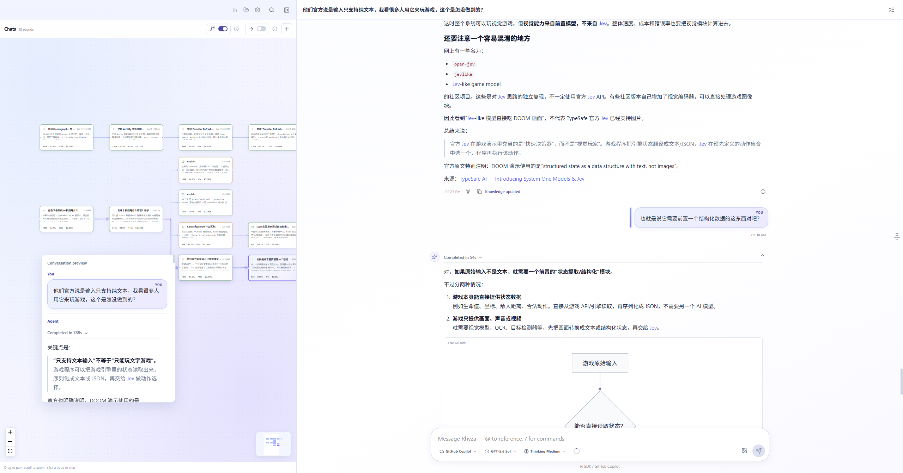
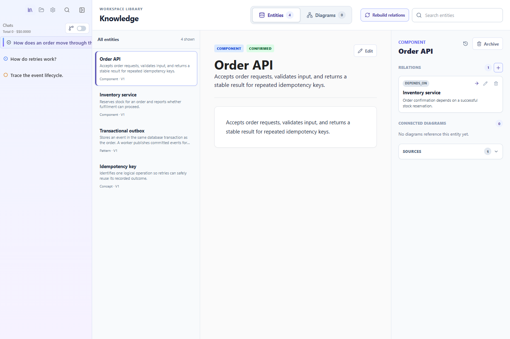

<p align="center">
  
</p>

<h1 align="center">Rhyza</h1>

<p align="center"><strong>让问题自由分叉，让知识持续积累。</strong></p>
<p align="center">An AI-native workspace for connected knowledge work.</p>

<p align="center">
  <a href="#快速开始">快速开始</a> ·
  <a href="docs/user-guide.md">使用指南</a> ·
  <a href="docs/features.md">功能与限制</a> ·
  <a href="CONTRIBUTING.md">参与贡献</a> ·
  <a href="https://github.com/wyunchi-ms/Rhyza/issues">反馈问题</a>
</p>

Rhyza 是一个本地优先的 AI 桌面工作台，适合阅读代码、研究问题和整理项目知识。你可以从任意历史回答继续追问，保留每条探索路径；再把值得复用的概念、关系和图表保存在同一个 Workspace 中，供后续对话使用。



<p align="center"><em>在节点图中浏览探索路径，预览历史回答，再回到当前对话继续追问。</em></p>

> [!NOTE]
> 当前为早期 MVP，主要在 Windows 10/11 上开发和验证，通过源码运行。尚未提供安装包、签名或自动更新；macOS 和 Linux 尚未完成验证。

## 为什么用 Rhyza？

读一个陌生项目时，一个问题往往会带出更多问题：请求从哪里进入？为什么这样设计？换一种方案会怎样？Rhyza 用分支保存这些追问，用知识库连接探索结果，让你下次回来时可以继续工作。

| 你想做的事                 | Rhyza 提供的能力                                                  |
| -------------------------- | ----------------------------------------------------------------- |
| 深挖某个细节，同时保留主线 | 从历史回答或选中文字创建分支，随时切回原路径                      |
| 找回之前的思路             | 会话树、节点视图、全局搜索和分支状态标记                          |
| 把一次回答变成可复用资料   | Workspace 级 Entity、Relation、Diagram，保留来源与变更记录        |
| 结合本地代码和文档提问     | 添加 Sources，搜索文本并读取相关片段                              |
| 在项目中尝试修改           | Git Worktree、Diff 和 patch 导出；隔离是否成功可在 Changes 中查看 |
| 使用已有的 AI 服务         | GitHub Copilot、Codex、Claude Code、Azure OpenAI 四种 Provider                  |

## 快速开始

### 1. 安装并启动

准备 **Windows 10/11、Node.js 22.12+、npm 和 Git 2.x**，以及一个可用的 AI Provider 账号。项目也支持 Node.js 20.19+；需要能访问 npm、Electron 下载地址和所选模型服务。

```powershell
git clone https://github.com/wyunchi-ms/Rhyza.git
cd Rhyza
npm ci
npm run electron:dev
```

请使用打开的 **Electron 桌面窗口**。`npm run dev` 仅用于前端页面开发，不具备真实聊天所需的桌面能力。安装或端口问题见[故障排查](docs/user-guide.md#6-常见问题)。

### 2. 选择目录与模型

1. 打开 **Settings → Workspace → Choose Folder**，选择本地项目目录。
2. 在 **Settings → AI Provider → Provider** 中选择服务，按下表连接。
3. 在 **Default Model** 中选择模型，或保留 Provider 默认值。

| Provider       | 连接方式                                                      | 额外要求                                                    |
| -------------- | ------------------------------------------------------------- | ----------------------------------------------------------- |
| GitHub Copilot | 点击 **Sign In**，按设备码提示完成授权                        | GitHub 账号具有 Copilot 权限；无需 Pi CLI 或 Copilot CLI    |
| Codex          | 点击 **Sign In**，检测已有 Codex 登录或打开授权链接           | 安装 Codex Desktop 或 Codex CLI                             |
| Claude Code    | 先在终端执行 `claude auth login`，再点击 **Check connection** | 单独安装 Claude Code CLI；Windows 可写工作流还需要 Git Bash |
| Azure OpenAI   | 先执行 `az login`，填写资源信息并点击 **Save configuration → Check sign-in** | 预装 Azure CLI；Azure OpenAI v1 Responses-compatible deployment；Cognitive Services OpenAI User 或等效权限 |

Azure OpenAI 的默认模型是保存的 deployment，Azure 用量与 Copilot 分开计费。当前仅支持公共云 HTTPS endpoint、文本和工具，不支持图片或 reasoning 控制；**Advanced** 可调整本地 context/response token 限制。Rhyza 不保存 Azure 凭据。

详细步骤、凭据位置和 Provider 差异见[连接 AI Provider](docs/user-guide.md#22-连接-ai-provider)。

### 3. 开始一次探索

1. 在 **Sources → Add sources** 添加想研究的代码或文档目录。
2. 点击左侧 **Chats → New chat**，试着问：

   > 请根据这个项目的源码解释一次请求的完整处理路径，并指出值得继续研究的两个问题。

3. 在回答中选中一段文字，点击 **Ask about this** 继续追问，或用 **Explain** 直接解释选区。
4. 返回原分支继续主线。在 **Knowledge** 查看提取出的概念和图表，在 **Changes** 检查知识或代码变更。

知识默认使用 **Suggest changes**：提取结果会先显示出来，接受后提交，拒绝则恢复变更前内容。可在 **Settings → Knowledge policy** 调整。

## 从对话到知识库

知识保存在 Workspace 中，供同一目录下的后续对话复用：

- **Entity**：稳定的概念、模块或对象，包含摘要、别名和来源。
- **Relation**：概念之间有依据的连接。
- **Diagram**：用 Mermaid 保存结构与流程，可关联已有知识对象。



_当前 Knowledge 界面，使用虚构的订单服务演示数据。_

需要交互式图表时，可按[扩展说明](extensions/pi-archify/README.md)安装可选的 **Archify Pi extension**。默认 Mermaid 无需安装扩展；Pi 插件目前只面向 GitHub Copilot 工作流提供支持。

## 数据与当前边界

- 会话、知识、Sources 和布局按 Workspace 路径保存在本地。切换目录会加载另一套状态。
- 使用 AI 时，对话和相关检索内容会发送给所选 Provider；本地优先不表示离线推理。
- Sources 当前使用文本检索，`indexed` 表示文件清单已建立，不代表已生成向量索引。
- Worktree 创建失败时可能回退到原 Workspace。修改文件前请检查实际路径与隔离标记，具体权限取决于 Provider。
- Hybrid 知识策略目前与 Automatic 相同；Confidence threshold 尚未接入过滤逻辑。

更多细节见[功能与限制](docs/features.md)和[本地数据说明](docs/user-guide.md#5-本地数据)。

## 文档与开发

| 文档                                                               | 内容                                      |
| ------------------------------------------------------------------ | ----------------------------------------- |
| [使用指南](docs/user-guide.md)                                     | 首次配置、日常工作流、Provider 与常见问题 |
| [功能与限制](docs/features.md)                                     | 已实现、部分实现与尚未实现的能力          |
| [开发指南](docs/development-guide.md)                              | 环境、架构、命令、持久化和验证            |
| [性能诊断](docs/performance-diagnostics.md)                        | 输入卡顿、渲染与持久化耗时排查            |
| [HTML Preview 协议](docs/html-previews.md)                         | 扩展如何交付可交互 HTML                   |
| [产品记忆与设计原则](docs/product-memory-and-design-principles.md) | 分支、引用和知识对象的设计约束            |

构建并运行本地产物：

```powershell
npm run build
npm run electron:start
```

欢迎提交问题、文档改进和代码贡献。环境设置、验证要求与提交说明见 [CONTRIBUTING.md](CONTRIBUTING.md)。

## 致谢与许可说明

Rhyza 使用 Pi SDK、Electron、React、Mermaid 和 React Flow 构建，集成 Codex，并调用用户自行安装的 Claude Code。可选 Archify 扩展的版权与许可见 [THIRD_PARTY_NOTICES.md](THIRD_PARTY_NOTICES.md)。

仓库 `package.json` 当前声明 `ISC`，尚未提供项目级 `LICENSE` 文件；第三方组件保留各自许可。
